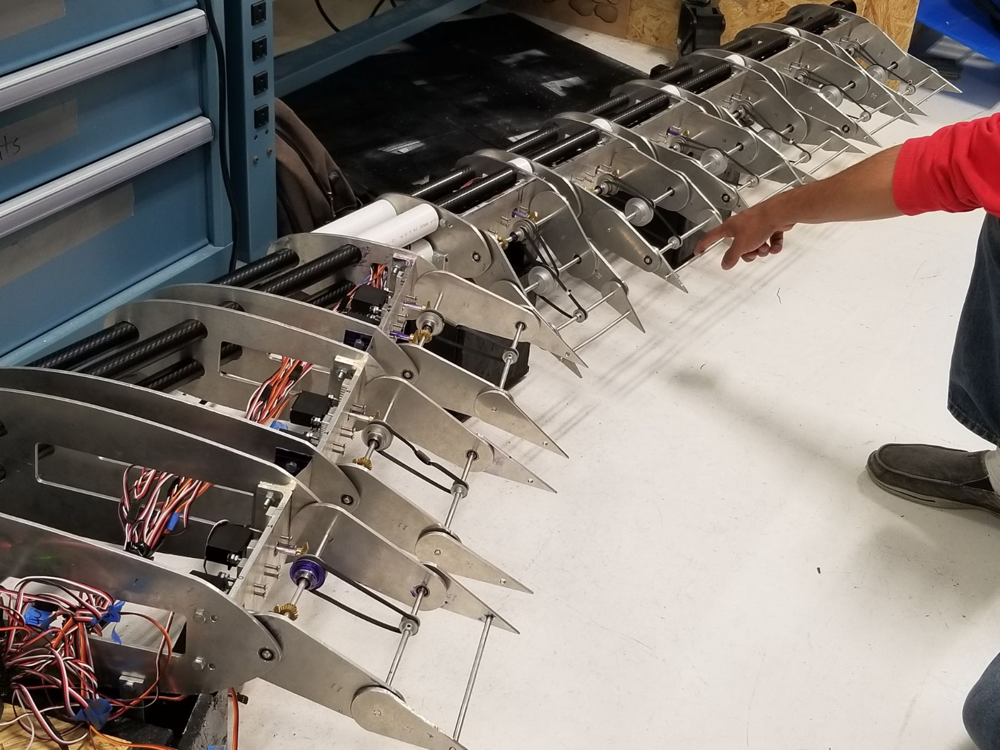
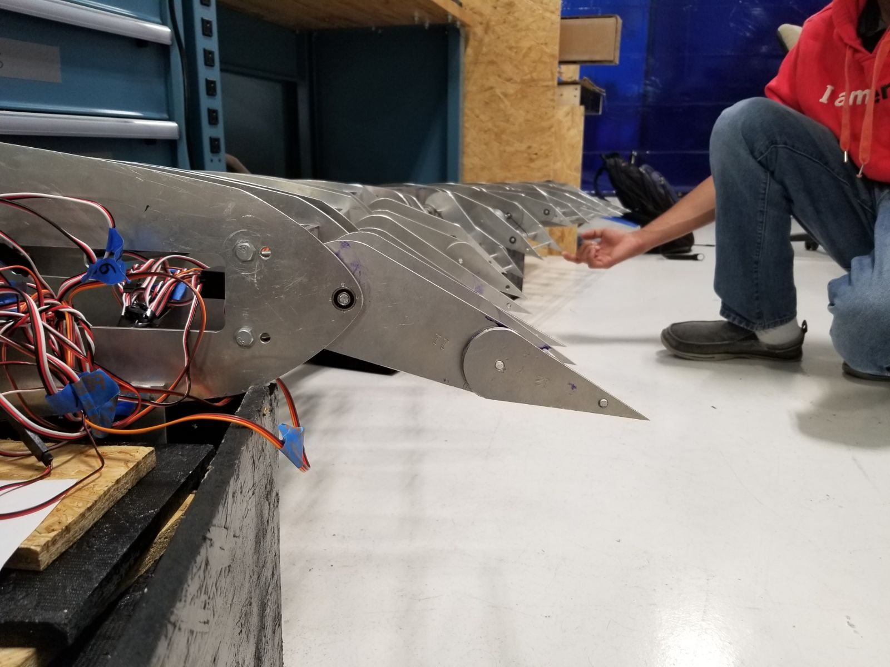

<!-- # Welcome to my page -->

My name is Akshay Aravamudan. I am currently a PhD student in computer engineering at Florida Institute of Technology. My primary interests are Machine learning, Data Science and Stochastic Point Processes. I recently (July 2019) graduated with my Master's Degree in Computer Engineering from Florida Institute of Technology. The following page is used to track my current research interest and to maintain a record of works, both academic and extra-curricular, that I have completed throughout my college career. You can find my resume [here](/docs/Akshay_Aravamudan_resume_2019-10-26-2.pdf).

## Bio

I joined [Florida Tech](https://www.fit.edu) at 2014 to purse my Bachelor's degree in computer engineering. I started with an interest in microcontrollers and microcomputers. During my undergraduate years, I developed a passion for machine learning, starting with a simple classification tools. I got interested in the intricacies involved in developing complex models, which eventually led me down the path of neural networks. I ended up taking courses like Pattern Recognition and Neural Networks. I continued onto pursue my Master's degree, working under adviesement of [Dr. Georgios Anagnastopolous](https://www.fit.edu/faculty-profiles/3/georgios-anagnostopoulos/). My master's thesis dealt with the study of information spread and more specifically utilizing it better understand the spread of software vulnerabilities in their domains. 

## Current Research Interests

1. Information Diffusion
2. Stochastic Point Processes
3. Information Embedding
4. Influence Detection

## Projects

The following projects have been arranged in order of recency.

### Master's thesis

The title of my Master's thesis is `Survival Analysis for Information Diffusion` and can be found [here](docs/Master_s_Thesis___Akshay_Aravamudan.pdf). The main theme of the thesis is information diffusion; the spread of information within a network. The model is based on nodes and we look at how the infection of a node or collection of nodes in a network influences the future infection (referred to as intensity in stochastic process literature) of the remaining nodes. We have built upon an existing algorithm called [``Netrate``](https://cs.stanford.edu/people/jure/pubs/netrate-netsci14.pdf). The presentation slides can be found [here](docs/Akshay___MS_Thesis_Defense_Presentation.pdf)

### Senior Design

I was the controls systems lead in my senior design project `MorphWing`. We designed, manufactured and engineered a wing designed to dynamically adjust to the state of optimal drag. The control system was responsible for budget creation, physical model assembly. We were in continuous contact with the Structures team to accomodate control system constraints. I was personally responsible for the backend circuit setup and [code](https://github.com/aaravamudan2014/morphWingBackEnd). Below are a few images and a gif of the final product that we presented in the 2018 Senior Capstone design at Florida Tech.  

### Other projects of relevance
1. [Container Migration](https://github.com/aaravamudan2014/BranchAndBound) 
2. [Discriminant Analysis classifier](https://github.com/aaravamudan2014/DiscriminantAnalysisClassifier)
3. [Population Prediction LSTM](https://github.com/aaravamudan2014/PopulationPredictionLSTM)
4. [Branch and Bound: an OpenMP Implementation](https://github.com/aaravamudan2014/BranchAndBound)
5. [Torque3D](https://github.com/aaravamudan2014/Torque3D)
6. [File System for and FRAM](https://github.com/aaravamudan2014/FRAM_FS)

### Contact info
I can be contacted via my email aaravamudan2014@my.fit.edu or via my [Linkedin page](https://www.linkedin.com/in/akshay-aravamudan-49a470b7/)
